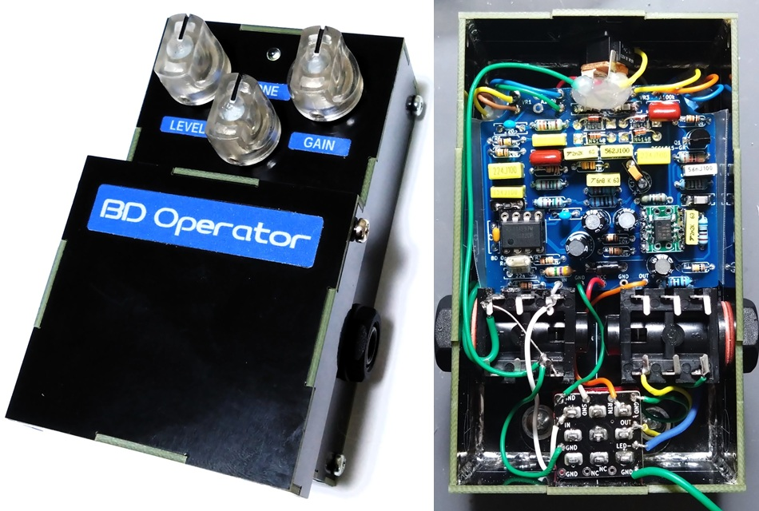
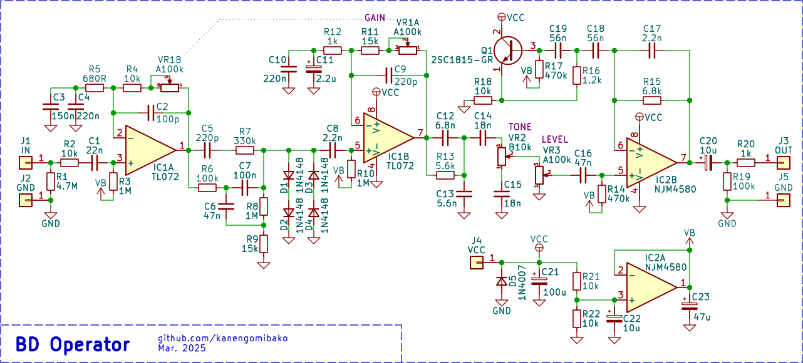
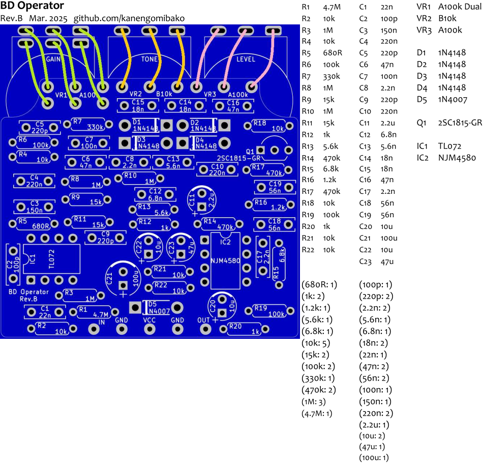

# BD Operator
 

以前製作した[オペアンプバージョンのBOSS BD-2](https://drugscore.blog.fc2.com/blog-entry-297.html)を、トゥルーバイパス用に簡略化したエフェクターです。

→ [基板販売ページはこちら](https://kanengomibako.booth.pm/items/6718691)

------

### ▽回路図
 [OpAmp Blues Driver](https://drugscore.blog.fc2.com/blog-entry-297.html)と基本的に同じで、入手しやすい100kAデュアルポットを使用するようにしました。部品点数を減らすため、入出力バッファをなくし、シミュレーテッドインダクタをオペアンプからトランジスタに戻してあります。

### 【基板】

 

VR1（GAINポット）の3番端子と6番端子については、配線なしでもOKです。C11（2.2μF）は電解コンデンサではなくフィルムコンデンサを使う方が精度がよいですが、スペース・高さに余裕がなく入らないかもしれません。オペアンプでの歪みがあるので、他の2回路入り（デュアル）オペアンプに差し替えて好みのものを探すのもよいかと思います。

#### ＜発振について＞

出力された音がスイッチの寄生容量等で再び入力に戻り過度に増幅されると、発振の可能性が出てきます。BOSSのペダルでは入力バッファやバイパス経路のバッファがあり、発振を防いでいます。トゥルーバイパス、特にギター直結では発振しやすくなるため、[以前製作したBOSS MT-2](https://drugscore.blog.fc2.com/blog-entry-274.html)では入力バッファを入れました。

ハイゲインエフェクターで問題になることが多い発振ですが、高音域が出やすいBD-2でも注意が必要となります。今回最初に設計した基板では、LEVELが低くてもGAINを70%程度に上げただけで発振する状態でした。おそらく入力部の近くにGAINポットが配置されているというレイアウトが原因だったと思われます。修正後の基板（Rev.B、販売用のもの）では、問題はなくなりました。しかしながらGAINとLEVELが**両方とも**フルに近い状態では発振するので、念のため注意が必要となります。
